## javaGameMVC

### Aplikacja webowa zrobiona w frameworku Spring Boot jako projekt zaliczeniowy na zajęcia z programowania w Javie

### 1. Baza danych
#### 1.1 Baza danych składa się z 8 tabeli:

- Users - przechowująca dane o użytkowniku.
- Game - przechowująca dane o grach.
- Studio - przechowująca dane o studiach game developerskich.
- Genre - przechowująca typy gier.
- AccountType - przechowująca typy kont użytkowników.
- Likes - Relacja wiele do wielu pozwalająca przechowywać informacje o grach polubionych przez użytkowników.
- Genre-Game - Relacja wiele do wielu pzwalająca przypisać typy o gry.
- Studio-Game - Relacja wiele do wielu pozwalająca przypisać studia developreskie do gry.

#### 1.2 Diagram ERD bazy danych

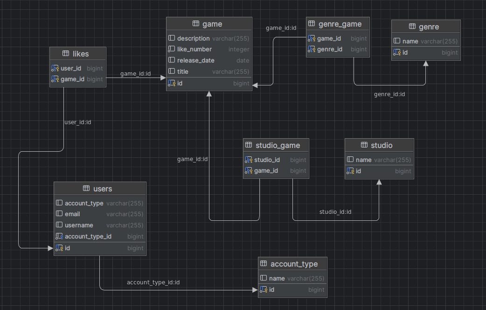

### 2. Aplikacja
#### 2.1 Encje

W folderze entity utworzony encje, które reprezentują tabele z bazy dancyh. Model dancyh jest następnie przez Hibernate mapowany na tabele w bazie.
Wszystkie utworzone encje odpowiadają głównym tabelą z bazy:
- Users
- Game
- Studio
- Genre
- AccountType

Do utworzenia tabel pośrednich użyto adnotacji @ManyToMany:

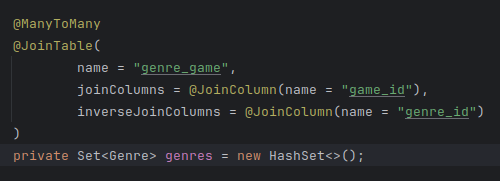

Przykład całej encji Game:

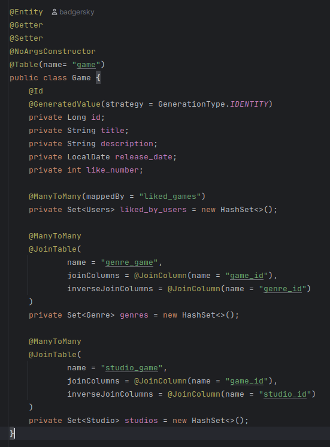

#### 2.2 Repozytoria

Repozytoria są interfejsami pozwalającymi na dostęp do danych za pośrednictwem encji.
Przykład GameRepository:

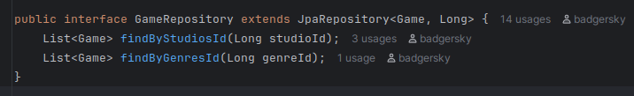

#### 2.3 Serwisy

Serwisy są klasami implementującymi logikę biznesową aplikacji. Pośredniczą pomiędzy kontrolerami, a bazą danych.
Przykład GameService:

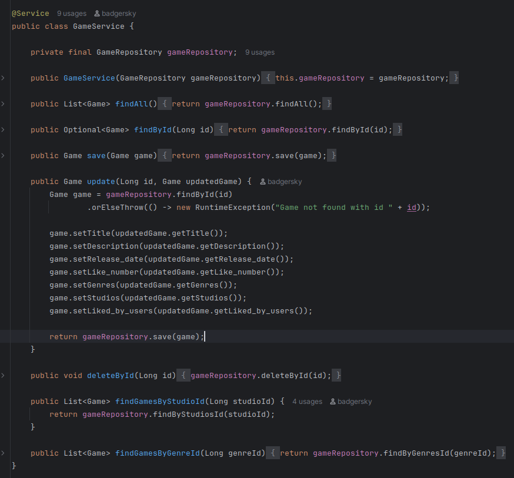

#### 2.4 Kontrolery

Kontrolery są klasami obsługującmi w Spring Boot żądania HTTP, mapują żądania do konkretnych metod w serwisach oraz 
łączą frontend a backendem aplikacji.
Przykład GameController:

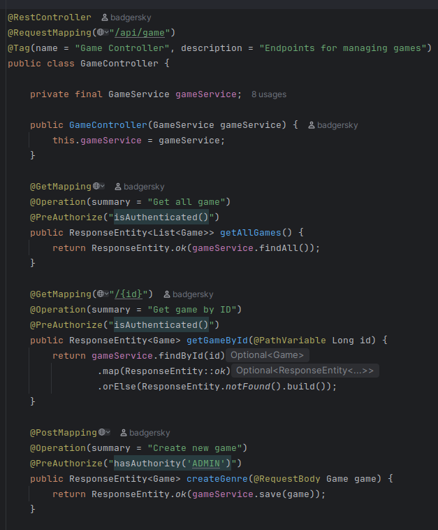

### Interfejs

Do stworzenia interfejsu użytkownika posłużoną się narzędziem swagger. Interfejs swgger pozwala na dostęp do wszystkich
endpointów i korzystanie z API. Aby z niego skorzystać dodano odpowiednie zależności do projektu, następnie używając 
adnotacji @Tag i @Operation można dodać opisy endpointów widoczne na interfejsie.
Przykład GameController:

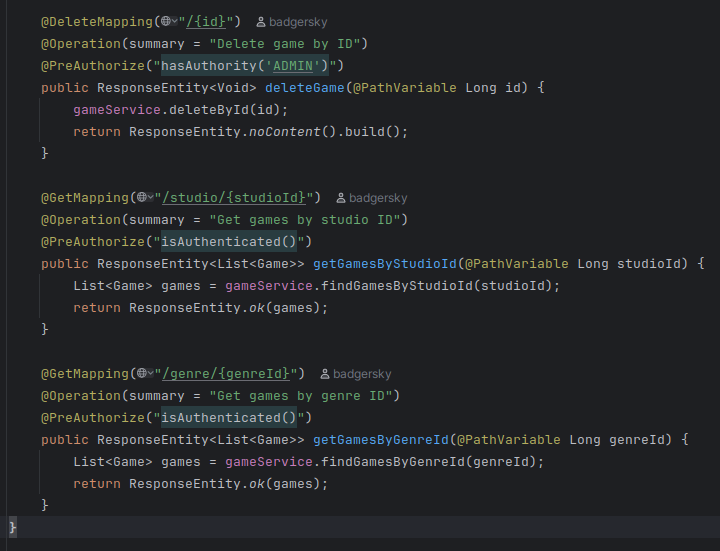

GameController w swagerze:

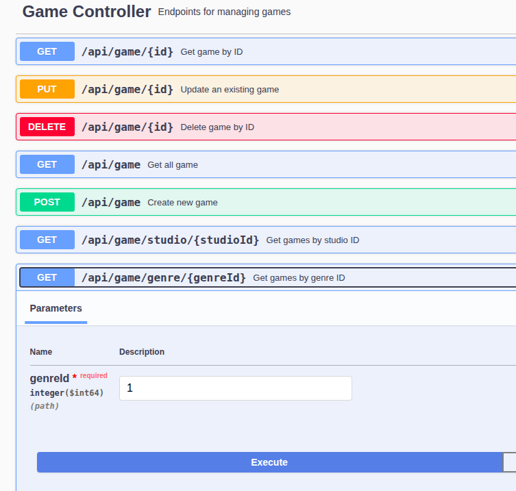

Wynik żądania pobrania gier po id typu gry w swagerze:

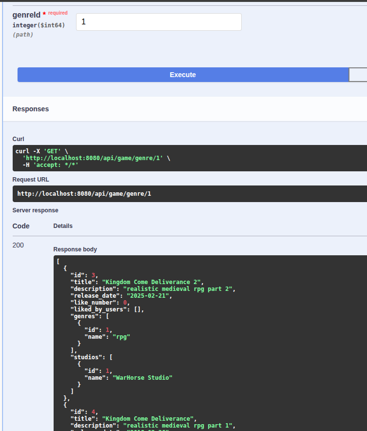

### Security

Do logowania i sprawdzania uprawnień użytkowników wykorzystano Spring Security, które należało dodać do zależności.
Proces dodawania autentykacji do aplikacji:  
Utworzenie klasy CustomUserDetails - klasy, której spring securiy używa do przechowywania informacji o użytkowniku. 
Klasa zawiera też metodę przypisującą użytkownikowi rolę na podstawie pola w tabeli AccountType. Dostarcza też metody 
zwracające hasło i username użytkownika.

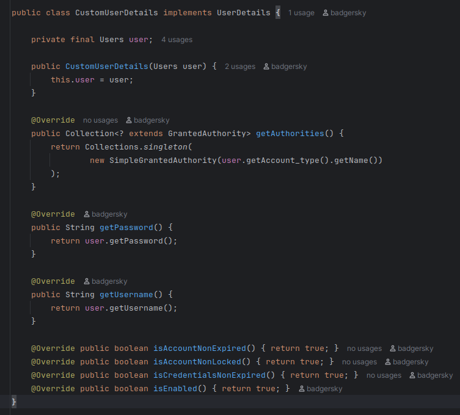

Utworzenie klasy CustomUserDetailsService - klasy, która szuka użytkownika w bazie danych.

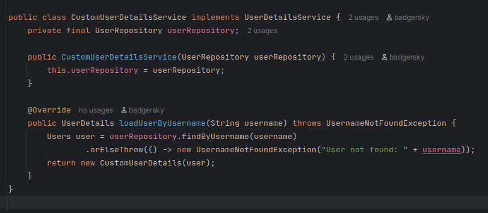

Utworzenie klasy SecurityConfig - ustawia się w niej z jakiej funkcji szyfrującej hasło ma korzystać aplikacja, 
jakiej klasy UserDetail oraz jakiego menadżera logowania ma użyć aplikacja. W klasie ustawia się też szczegóły dotyczące
dostępu użytkowników do endpointów, formularza logowania i adresu wylogowania.

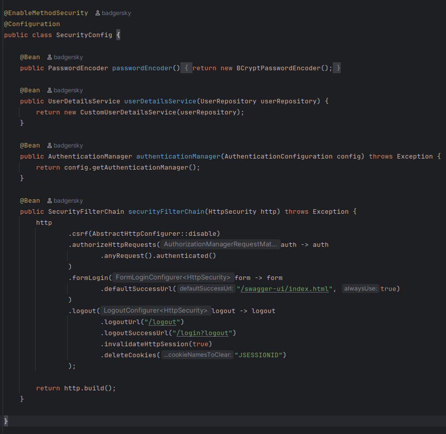

Większą kontrolę nad typ jacy użytkownicy mają dostęp do konkretnych endpointów można osiągnąć stosując adnotacje
@PreAuthorize, w której określa się jaką rolę ma mieć użytkownik mający dostęp, lub czy wystarczy, że będzie zalogowany.
Przykłąd PreAuthorize w GameController:

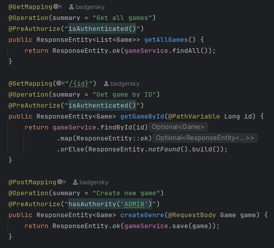

### Tests

Napisano testy jednostkowe i integracyjne pokrywające 90% aplikacji.  
Raport pokrycia testów:

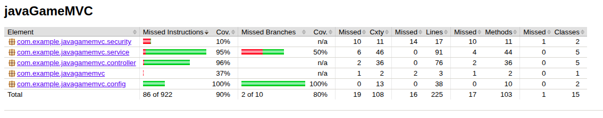
